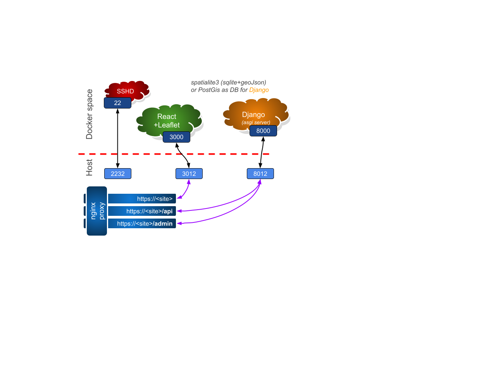

# [neOCampus] autOCampus-ICU | supervision
______________________________________________________________

[neOCampus] autOCampus ICU (i.e I see you) is the supervision app of the autonomous vehicles lurking our campus.

This app. is responsible to manage all of the neOCampus IoT end-devices:

  - MQTT authentification and authorization (linked to mosquitto auth plugin)
  - send end-devices' specific JSON configuration
  - Prometheus end-point (internal monitoring)



### Environment variables ###
When you start this application (see below), you can pass several environment variables:

  - **DEBUG=1** this is our application debug feature
  - **SIM=1** this is our application simulation feature: kind of *read-only* mode (i.e no write to any database)
  - **DEVEL=1** in DEVELOPPER mode, Django backend will be sqlite
  - **DJANGO_DEBUG=1** this is debug to Django's internals
  - **DJANGO_SECRET_KEY** Django's internal secret key (will be dynamically generated if not specified)
  - **MQTT_SERVER** and **MQTT_PORT**
  - **MQTT_USER** and **MQTT_PASSWD** are sensOCampus own MQTT credentials
  - **MQTT_TOPICS** json formated list of topics to subscribe to (usually #/device)
  - **MQTT_UNITID** is a neOCampus identifier for msg filtering
  - **PGSQL_USER** and **PGSQL_PASSWD** are Postgres credentials for sensOCampus' internal database
  - **PGSQL_SERVER**=172.17.0.1   this is the docker gateway
  - **PGSQL_PORT**=5432
  - **PGSQL_DATABASE**=autocampus-icu    name of the database


### [HTTP] git clone ###
Only **first time** operation.

`git clone git@github.com:fthiebolt/autOCampus-icu.git`  

### git pull ###
```
cd <repository>
git pull
```

### git push ###
```
cd <repository>
./git-push.sh
```

**detached head case**
To commit mods to a detached head (because you forget to pull head mods before undertaking your own mods)
```
cd <repository>
git branch tmp
git checkout master
git merge tmp
git branch -d tmp
```


### start container ###
```
cd <repository>
SIM=1 \
DJANGO_DEBUG=1 DEBUG=1 DEVEL=1 \
MQTT_PASSWD='passwd' PGSQL_PASSWD='passwd' \
docker-compose --verbose up -d
```

### fast update of existing running container ###
```
cd <repository>
git pull
DEBUG=1 MQTT_PASSWD='passwd' PGSQL_PASSWD='passwd' docker-compose --verbose up --build -d
```

### ONLY (re)generate image of container ###
```
cd <repository>
docker-compose build --force-rm --no-cache
[alternative] docker build --no-cache -t autOCampus-icu -f Dockerfile .
```

### start container for maintenance ###
```
cd <repository>
docker run -v /etc/localtime:/etc/localtime:ro -v "$(pwd)"/app:/opt/app:rw -it autOCampus-icu bash
```

### ssh root @ container ? ###
Yeah, sure like with any VM:
```
ssh -p xxxx root@locahost
```

